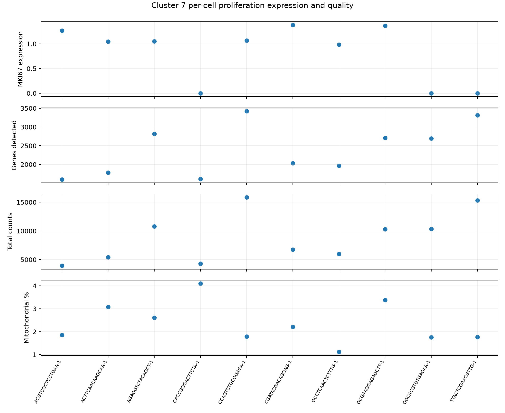
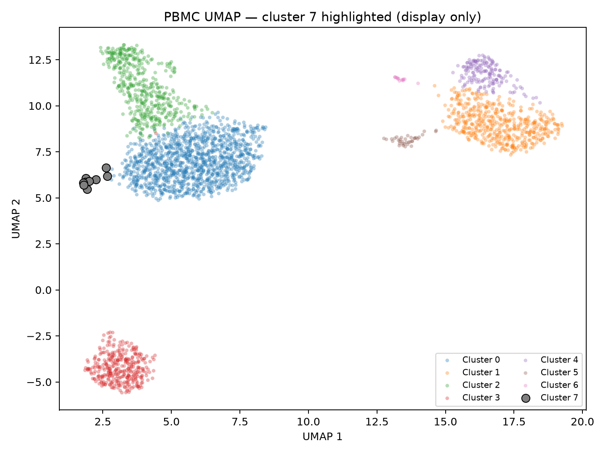

# PBMC cluster-7 follow-up decision

## Decision

**SET ASIDE cluster 7 for the one follow-up sequencing run.** The available evidence supports a small, reproducibly proliferating population, but not a coherent named cell type. The required identity statement is therefore: **no coherent identity**. This is not a novelty claim.

## The owner’s question

Alex Rios initially asked whether **cluster 4**—a group that appeared unusual on the map—was a genuinely unusual cell population or a known group that had not yet been recognised. The interview clarified that map separation alone was insufficient: gene activity had to be coherent across cells and distinct from the other clusters, without quality differences explaining it.

During the interview, the budget decision was corrected from the initial cluster-4 framing to the final question: **should cluster 7 be sequenced next or set aside?** Cluster 4 remains the owner’s named comparator, but cluster 7 is the decision target and is compared with all other clusters.

## Observed results

All values below are taken from files in `results/` and should be read with their source file. Owner-supplied numbers were treated as unverified and checked against the dataset’s stored QC columns.

### Cluster-7 markers

The strongest ranked genes are dominated by proliferation, replication, cytoskeletal, and housekeeping signals rather than one lineage. The marker table, including detection prevalence, medians, log fold-changes, and adjusted p-values, is in [`cluster7_markers.csv`](results/cluster7_analysis/cluster7_markers.csv).

The most important replication markers are:

| Gene | Cluster 7 detection | QC-matched detection |
|---|---:|---:|
| `MKI67` | 70% | 0.5% |
| `TOP2A` | 50% | 0.5% |
| `TYMS` | 80% | 0.5% |
| `BIRC5` | 70% | 0.5% |
| `RRM2` | 70% | 0.5% |

The full cross-cluster table is [`replication_marker_prevalence.csv`](results/cluster7_analysis/replication_marker_prevalence.csv). Common genes and depth-sensitive genes were not accepted as identity evidence merely because they passed a p-value or logFC screen: the analysis reports their prevalence in cluster 7, every other cluster, and QC-matched cells, and excludes genes detected in at least half of the rest from the stricter identity-candidate list.

### Cluster and quality comparison

| Cluster | Cells | Detected genes: mean / median | Total counts: mean / median | Mitochondrial %: mean / median |
|---:|---:|---:|---:|---:|
| 0 | 1,197 | 805.98 / 808 | 2,335.10 / 2,310 | 1.96 / 1.76 |
| 1 | 489 | 857.11 / 848 | 2,379.83 / 2,305 | 2.45 / 2.25 |
| 2 | 445 | 829.19 / 826 | 1,959.55 / 1,954 | 2.51 / 2.26 |
| 3 | 347 | 711.37 / 671 | 1,917.64 / 1,759 | 2.26 / 2.08 |
| 4 | 163 | 1,216.27 / 1,263 | 3,665.18 / 3,781 | 2.55 / 2.41 |
| 5 | 36 | 1,501.47 / 1,565.5 | 5,070.39 / 5,293 | 1.96 / 1.96 |
| 6 | 13 | 576.15 / 350 | 1,651.08 / 916 | 1.93 / 1.57 |
| 7 | 10 | 2,394.10 / 2,363.5 | 8,882.90 / 8,498.5 | 2.37 / 2.03 |

Source: [`dataset_inspection.txt`](results/dataset_inspection.txt). Cluster 4 is the owner’s named comparator. Its reported 1,263 detected genes matches the stored median; cluster 6’s reported 350 also matches its stored median. These values are not interpreted as mismatches simply because the owner rounded a median.

### Consistency and stability

The proliferation signal is per-cell rather than a cluster-average artefact. The leave-one-cell-out and every leave-two-cell-out analysis retained the replication signal under the pre-specified rule. Results are in [`cluster7_leave_out_stability.csv`](results/cluster7_analysis/cluster7_leave_out_stability.csv) and per-cell lineage/QC details are in [`cluster7_per_cell_lineage.csv`](results/cluster7_analysis/cluster7_per_cell_lineage.csv).

The per-cell view is deliberately shown as separate panels because cell order has no biological meaning:



### Doublets and duplicates

Scrublet, run on the raw-count layer, predicted **1 of 10** cluster-7 cells as a doublet. The strict lineage marker check labelled **60%** of cluster-7 cells as multi-lineage versus **36%** of QC-matched cells; this is concerning but not specific enough to call the entire cluster doublets. `NKG7` and `GNLY` were treated as NK/cytotoxic markers because cytotoxic T cells can also express them. Scrublet output and lineage calibration are in [`scrublet_all_cells.csv`](results/cluster7_analysis/scrublet_all_cells.csv), [`lineage_flags_all_cells.csv`](results/cluster7_analysis/lineage_flags_all_cells.csv), and [`qc_matched_lineage_calibration.csv`](results/cluster7_analysis/qc_matched_lineage_calibration.csv).

The file inspection found zero duplicate cell identifiers, zero duplicate gene identifiers, and zero exact duplicate raw-count rows. No doublet annotation or provenance field was present. These checks do not exclude biological doublets, ambient RNA, or near-duplicates.

## Interpretation

**Observed:** cluster 7 has ten cells, high stored gene/count summaries, a strong replication-gene program, one Scrublet-positive cell, and a higher strict multi-lineage rate than the QC-matched background.

**Interpretation:** the stable replication program is consistent with genuinely proliferating cells. The evidence does not establish one lineage for all ten cells, and the doublet signal is insufficiently specific to explain the whole cluster. The defensible identity is therefore **no coherent identity**, rather than a named cell type or a novel population.

## Stronger alternative

The owner’s named comparator is cluster 4. Alternatives were judged as better leads for the follow-up run—not simply as larger or cleaner clusters—and had to meet the same coherence bar as cluster 7. No cluster was accepted as a stronger alternative because cluster 7 itself does not meet the required named-identity/coherence standard and no alternative has been established here with a complete, validated marker and per-cell comparison. **No stronger alternative identified.**

## Limitations

- Cluster 7 has only 10 cells; one or two cells can strongly affect estimates.
- The data represent one donor/sample context with no biological replicates. Cell-level p-values cannot establish population-level reproducibility.
- Donor, batch, treatment, collection time, provenance, filtering, and preprocessing history are missing.
- Ambient RNA may create misleading low-level marker expression.
- Cluster 6 is especially fragile because its detected-gene counts are low and uneven.
- A display UMAP is not evidence of identity or novelty.
- No prospective surface marker or lab-isolation strategy can be justified from these results.



The UMAP is shown for orientation only; it was not used as evidence or to choose comparison clusters.

## Running the project

The dataset is not committed. Put the supplied file at:

```text
data/pbmc3k.h5ad
```

Use the existing environment, or install the pinned runtime requirements into a suitable environment:

```bash
python -m venv .venv
.venv/bin/pip install -r requirements.txt
```

If `.venv/` already exists, do not create another environment. From the repository root, run the navigator with:

```bash
.venv/bin/uvicorn app:app --port 8000
```

Open:

```text
http://127.0.0.1:8000
```

The app loads the H5AD once at startup. It provides:

- an existing-UMAP display with categorical cluster colours and selected-cluster highlighting;
- colouring by a gene or by `n_genes`, `total_counts`, or `pct_mito`;
- a cluster selector, initially set to cluster 7;
- top markers with score, logFC, adjusted p-value, detection prevalence, and medians;
- individual-cell QC values;
- a per-cell expression and quality plot.

## AI use and review

I used an AI coding assistant to inspect the supplied project documents and H5AD contents, implement the inspection and analysis scripts, build the FastAPI/Plotly navigator, generate the figures, and draft this memo. I checked and changed the work by correcting the QC statistic interpretation, replacing raw-count marker ranking with log-normalised `rank_genes_groups`, calibrating lineage tests against all clusters and QC-matched cells, running Scrublet, running leave-one/two-cell stability checks, correcting app runtime errors, and checking the app’s API and Python syntax.

A second assistant (Claude) reviewed the work and ran independent checks, including cross-cluster calibration, Scrublet and stability readouts, and browser tests of the app. No claim is made here that the app was visually rendered by this assistant.
